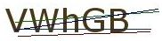

# MouseHunt Bot
MouseHunt is a Facebook game where users play by clicking on a link every 15 minutes. While this process is easily automated, the game developers set up a preventive measure in the form of a captcha every few hours.

As a beginner to image processing, this seemed like a good project to work on.

## Results
A sample of 10 images was collected for initial testing.

Simple inspection shows that the captchas always contained 5 characters of the same font, with 4 randomly placed lines. Furthermore, the main text had 2 possible font colours, while the colours of each of the 4 lines were always the same.

 <i>Example of original and processed images</i>

Images were first converted to grayscale and binary thresholded. In order to remove the lines, the images were then eroded, as the lines were thinner. Subsequent dilation restored the original characters.

## Future work
OCR is currently being done via Tesseract. As I am currently learning object localization and recognition, I hope to eventually implement the OCR myself.

With the bot deployed and running on a Raspberry Pi, I am currently capturing and storing all captchas, which will eventually contribute to my dataset for training.

## Disclaimer
I do not play MouseHunt.
